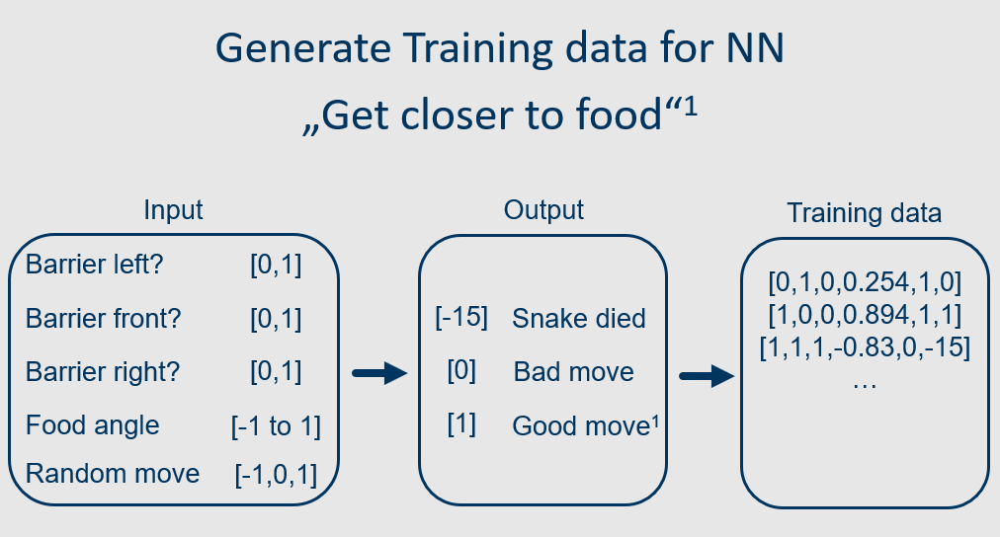
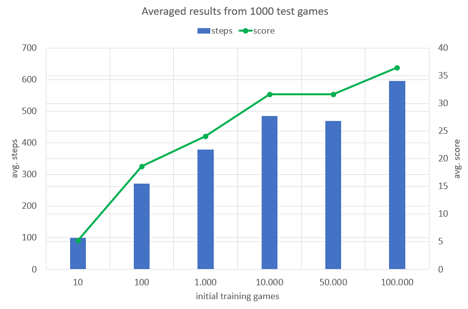

# Snake AI
Training a neural network to play snake

## Abstract
A neural network is trained to play snake better than a search algorithm under the same objective. Two agents are implemented and their performance
is compared. 

## Installation
Install python
```
$ sudo apt install python3-pip
```

Install required tools
```
$ pip3 install –user numpy tensorflow tflearn h5py
```

## Overview
To measure the performance, the snake’s steps and the score are counted for every game.
The score is the main factor used to judge a game agent’s performance. 
One game agent uses a search algorithm while the other one uses a trained neural network. 
The former is further referred to as the search agent while the latter is referred to as the NN agent. 
For a meaningful comparison, both agents train/play under the same objective “get closer to food”.
The neural network implementation uses TFLearn, a higher abstraction of Tensorflow providing access to all Tensorflow functions.

## Search agent
The search agent uses a search algorithm. 
It chooses one of three directions (LEFT, FORWARD, RIGHT) every step to get closer to the food item. 
If a direction is blocked by the snake or the edges of the grid, a different direction is chosen. 
The algorithm does not precompute the whole path to the food item involving multiple steps. 
It chooses one direction individually every step.

## Neural Network agent
The neural network is trained with games generated from random walk. 
When generating these games, every step the snake does is appended to the training data. 
The input consists of five values while the output is one value (see image below)
<p align="center">
	
</p>
To generate data that resembles the objective “get closer to food”, three outputs are possible for every step. 
The snake dies, makes a bad move, or makes a good move. A move is considered good when the snake gets closer to the food. 
The snake’s death is weighted with a -15, compared to a 0 and a 1 for a bad and a good move respectively. 
This way the snake learns that staying alive is more important than getting closer to the food with every individual step. 
(Picking even lower values than -15 will not yield better results infinitely as the snake will only moves in circles to avoid dying at some point.) 


After training, the steps and the score are averaged over 1000 test games. 
The results for an increasing number of training games is shown in the graph below. 
<p align="center">
	
</p>
A move is picked every step from all three possible moves (LEFT, FORWARD, RIGHT). 
The input for the trained neural network is the same as in training with the difference that three inputs are given. 
The output is one value that represents the probability of that move being beneficial. 
The move with the highest output value is chosen for the snakes next step.
When using more than 100.000 training games the NN agent will not indefinitely reach a higher score. 
Rather, an overfitting becomes more likely when the networks hyperparameters (epochs, batch size, learning rate…etc.) are not adjusted. 
Here, the hyperparameters were kept consistent for all numbers of training games.


For visualisation of the NN agents performance for different numbers of initial training games look at the GIFs below.

| initial games   |10|100|1.000|10.000|100.000|
| :---:           |:---:|:---:|:---:|:---:|:---:|
| GIFs            ||||||
| score           |4 | 16|   22|    33|     42|

## Results
The averaged results from 1000 test games for both agents can be seen in the table below. The best NN agent was trained on 100.000 training games.
|         | Search         | Best NN       |
| :---:   |    :---:       |    :---:      |
| steps   | 480.93         | 595.10        |
| score   | 31.88          | 36.46         |
As mentioned before, the search agent only ever picks a valid move even if the snake cannot get closer to the food with this step. 
The NN agent does not underly this rule prior to training. It learns not to run into itself or hit the edges of the grid only over many iterations. 
After being trained on 10.000 games or more, the NN agent only chooses a direction that is not blocked even if the snake cannot get closer to 
the food with this step. This behavior ensures that the snake will only die if all directions are blocked and it has no way out. 
It resembles the search agent’s behavior. Furthermore, the NN agent develops strategies that involve walking further away from the food for 
multiple steps in a row in order not to hit itself when the snake gets longer.

## Third party libraries
[TFLearn](http://tflearn.org/)

[Tensorflow](https://github.com/tensorflow/tensorflow)

## Notes
Thanks to [Slava Korolev](https://github.com/korolvs) for the [blueprint](https://github.com/korolvs/snake_nn)